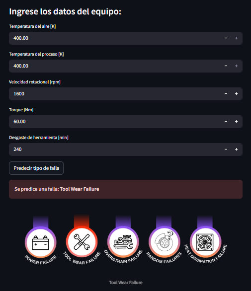
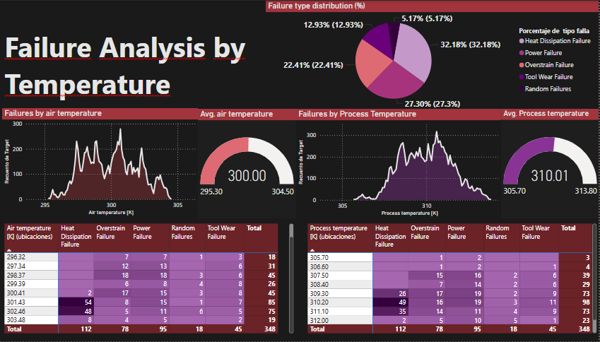
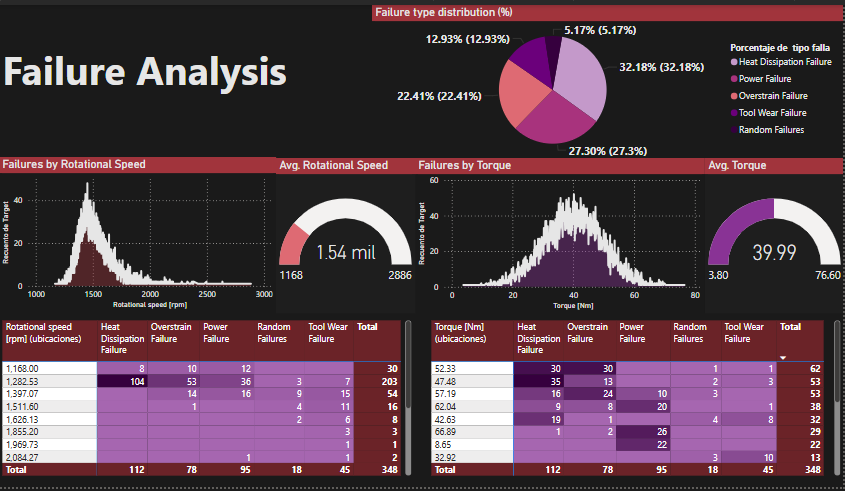
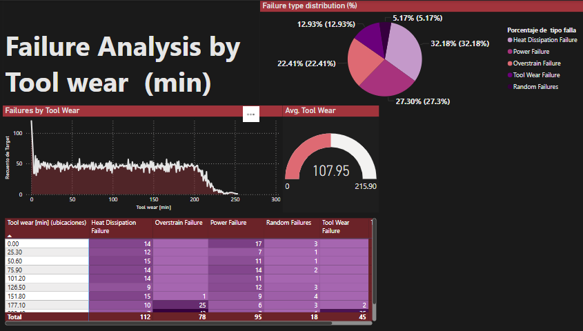

### 🔧 1. Predictive Maintenance – Mantenimiento Predictivo con Machine Learning

- **Objetivo:** Predecir el tipo de falla en equipos industriales a partir de variables como temperatura, torque, velocidad rotacional y desgaste de herramientas.
- **Tecnologías:** Python (Streamlit + Scikit-learn) + Power BI.
- **Datos utilizados:** Variables físicas extraídas de sensores.
- **Modelo:** Random Forest Classifier para clasificación del tipo de falla.
- **Dashboards en Power BI:**
  - Distribución de fallas por tipo (%)
  - Relación entre temperatura del aire y frecuencia de fallas
  - Indicadores de temperatura promedio/máxima/mínima

👉 *Incluye una app interactiva desarrollada en Streamlit para hacer predicciones personalizadas.*

---
