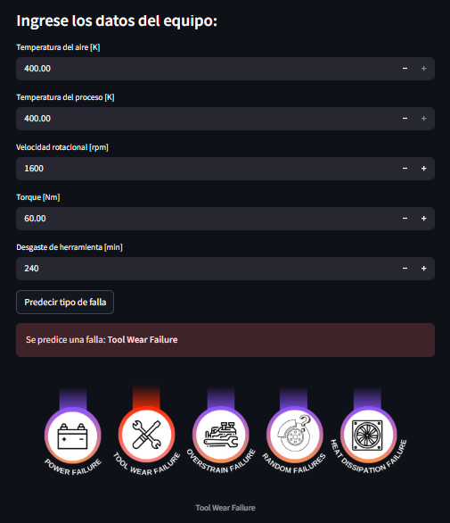
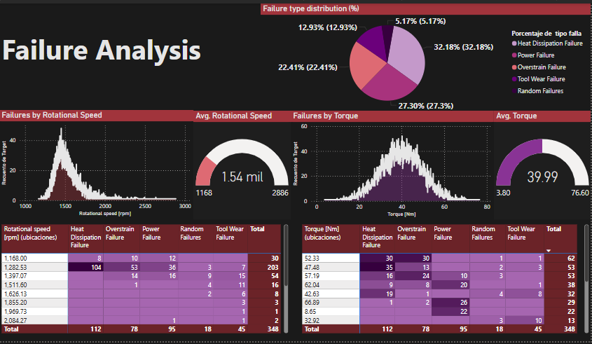
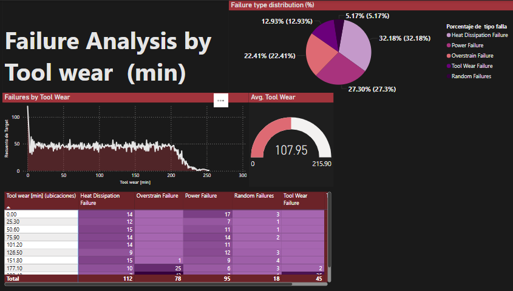
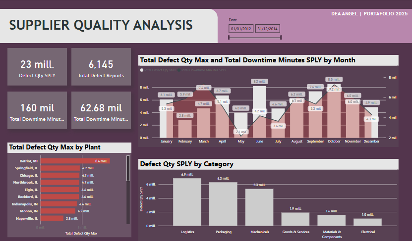
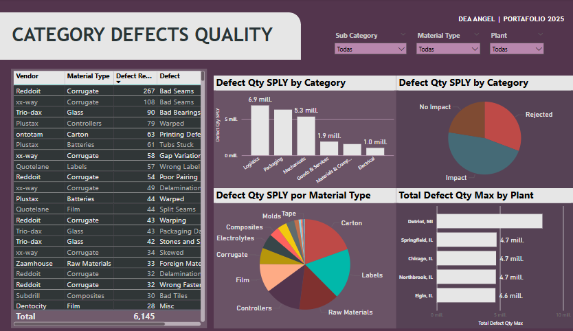

# DATA_BI_PROYECTOS

# 📊 Power BI & Machine Learning Portafolio

Este repositorio contiene una colección de dashboards e integraciones de Machine Learning desarrolladas en Power BI y Python. Cada proyecto tiene un enfoque distinto, pero con un mismo objetivo: **extraer valor de los datos para apoyar la toma de decisiones en entornos industriales y de manufactura**.

---

## 📁 Proyectos incluidos

### 🔧 1. Predictive Maintenance – Mantenimiento Predictivo con Machine Learning

- **Objetivo:** Predecir el tipo de falla en equipos industriales a partir de variables como temperatura, torque, velocidad rotacional y desgaste de herramientas.
- **Tecnologías:** Python (Streamlit + Scikit-learn) + Power BI.
- **Datos utilizados:** Variables físicas extraídas de sensores.
- **Modelo:** Random Forest Classifier para clasificación del tipo de falla.
- **Dashboards en Power BI:**
  - Distribución de fallas por tipo (%)
  - Relación entre temperatura del aire y frecuencia de fallas
  - Indicadores de temperatura promedio/máxima/mínima

👉 *Incluye una app interactiva desarrollada en Streamlit para hacer predicciones personalizadas.*

---

### 📦 2. Supplier Quality Analysis – Análisis de Calidad de Proveedores

- **Objetivo:** Evaluar el desempeño de los proveedores en relación con la calidad de los productos entregados.
- **Métricas clave:**
  - Porcentaje de defectos por proveedor
  - Tendencia de calidad en el tiempo
  - Tasa de rechazos vs volumen de entregas
- **Beneficios:**
  - Identificación de proveedores con desempeño deficiente
  - Toma de decisiones basada en evidencia
  - Mejora en la gestión de calidad de la cadena de suministro

---

## 🧠 ¿Qué habilidades se demuestran?

- Visualización y análisis de datos con Power BI
- Integración de Machine Learning con interfaces interactivas (Streamlit)
- Preprocesamiento de datos y entrenamiento de modelos de clasificación
- Desarrollo de tableros orientados a procesos industriales reales

---

