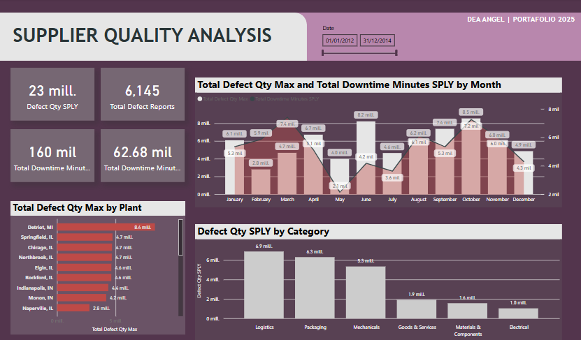
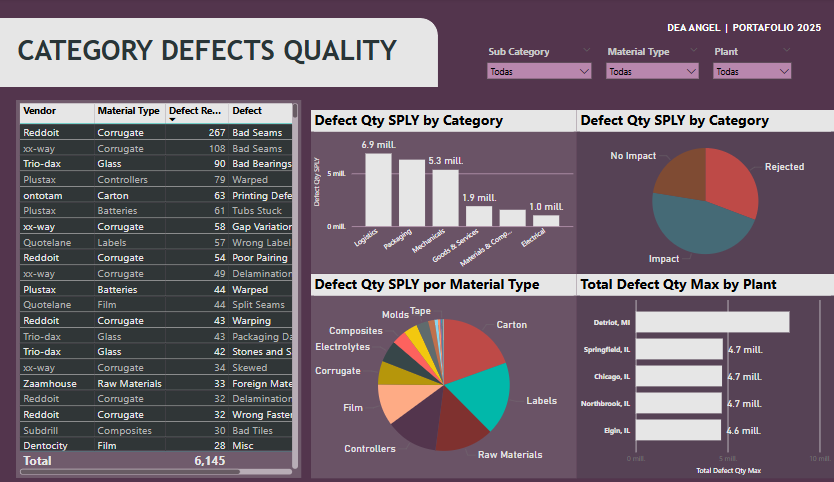

### 📦 2. Supplier Quality Analysis – Análisis de Calidad de Proveedores

- **Objetivo:** Evaluar el desempeño de los proveedores en relación con la calidad de los productos entregados.
- **Métricas clave:**
  - Porcentaje de defectos por proveedor
  - Tendencia de calidad en el tiempo
  - Tasa de rechazos vs volumen de entregas
- **Beneficios:**
  - Identificación de proveedores con desempeño deficiente
  - Toma de decisiones basada en evidencia
  - Mejora en la gestión de calidad de la cadena de suministro

---

## 🧠 ¿Qué habilidades se demuestran?

- Visualización y análisis de datos con Power BI, DAX
- Integración de Machine Learning con interfaces interactivas (Streamlit)
- Preprocesamiento de datos y entrenamiento de modelos de clasificación
- Desarrollo de tableros orientados a procesos industriales reales
- 

---

